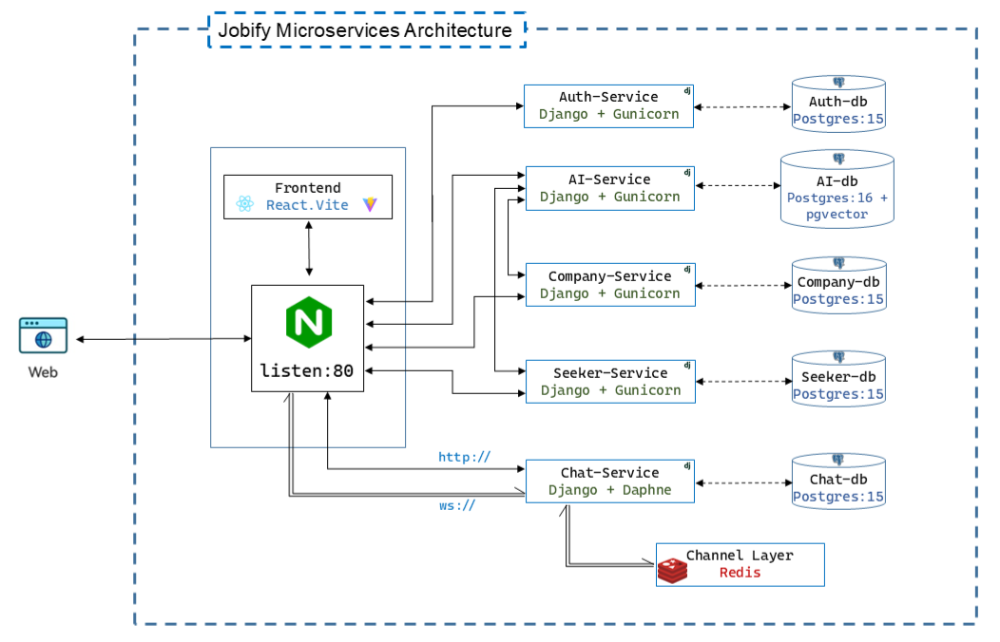

# Jobify 👩🏻‍💻💼


## 🔗Live link 👉  [https://jobify.bond](https://jobify.bond)

**Jobify** is a **microservices-based AI-powered job portal platform** built with **Django**, **Django REST Framework**, **React (Vite)**, **PostgreSQL**, **Redis**, **Docker**, and **pgvector**.

Unlike a basic CRUD job portal, Jobify is designed as a **production-style backend architecture** with **independent microservices**, **isolated databases**, **AI-powered cover letter generation**, and **semantic job matching** using **embeddings + cosine similarity**.

A key architectural decision in this project is that the **AI Service does not act as the primary owner of job/company/auth data**. Instead, it **retrieves and processes data from other microservices** to perform AI-specific operations such as semantic matching and content generation. This keeps service boundaries cleaner and avoids turning the AI service into a duplicate CRUD backend.

## 

## 📌 Project Overview

Jobify is a full-stack job platform that demonstrates:

- **True microservices architecture** (Auth, Company, Seeker, Chat, and AI)
- **Independent databases per service**
- **JWT-based authentication**
- **REST APIs with Django + DRF**
- **Real-time Chat with WebSockets** via ASGI and Redis
- **AI-powered cover letter generation**
- **AI job matching using embeddings**
- **Cosine similarity ranking**
- **Vector storage with pgvector**
- **Inter-service communication**
- **Dockerized local development**
- **Scalable backend design for real-world deployment**

This project is built to showcase **backend engineering, system design, AI integration, and service-oriented architecture** — not just frontend forms and CRUD endpoints.

---

## ✨ Core Features

### 🔐 Authentication & Authorization

- User registration and login (JWT auth)
- Protected API endpoints
- Profile and account handling
- Expandable role-based access control (RBAC)

### 🏢 Company & Job Management

- Company profile creation and management
- Job posting and listing
- Job details retrieval
- Service-owned job data in an isolated database
- Clear ownership of company and job-related business logic

### 🧑‍💻 Seeker Management

- Seeker profile building
- Manage skills, experience, and resumes conceptually
- Candidate matching metadata

### 💬 Real-Time Chat

- Direct real-time messaging using WebSockets
- Redis pub/sub mechanism
- Django Channels and ASGI server for async-friendly workflows

### 🤖 AI Cover Letter Generation

- Generate personalized cover letters based on title, description, skills, and candidate profile
- Clean separation of AI logic inside a dedicated **AI Service**
- Designed for extensibility (prompt tuning, retrieval augmentation, output control)

### 🧠 AI Job Matching (Key Differentiator)

- Retrieves relevant job data from other services
- Generates **embeddings** for job content / required skills
- Uses **PostgreSQL + pgvector** for vector storage
- Computes **semantic similarity** between candidate input and job postings
- Ranks jobs using **cosine similarity**
- Returns the most relevant jobs based on meaning, not just exact keyword overlap

### 🔄 Inter-Service Communication

- The **AI Service consumes data from other services** instead of being the primary source of truth
- Example flow:
  - Company Service owns job data
  - Auth Service owns user/auth data
  - AI Service fetches relevant data from these services
  - AI Service performs embedding generation, semantic scoring, and AI-powered outputs
- This avoids data duplication and keeps responsibilities clean

### 🐳 Containerized Development

- Each service runs in its own container
- Independent build and deployment lifecycle
- Easy local setup with Docker Compose
- Better scalability than a monolithic local dev setup

---

## 🏗️ Architecture

### Services

#### 1. Auth Service

Responsible for:

- user registration and login
- JWT token issuance and refresh
- user profile management
- authentication and authorization logic

#### 2. Company Service

Responsible for:

- company management
- job posting
- job listing and retrieval
- job-related business logic
- structured job data ownership

#### 3. Seeker Service

Responsible for:

- candidate profiles
- storing resumes
- defining candidates' skills and matching metadata

#### 4. Chat Service (ASGI)

Responsible for:

- handling WebSocket connections via Django Channels
- supported by Redis for pub/sub real-time notifications
- one-to-one chatting between entities

#### 5. AI Service

Responsible for:

- AI cover letter generation
- embedding generation
- semantic job matching
- vector similarity search with **pgvector**
- cosine similarity scoring

**Important:** The **AI Service is not the primary owner of company/job/auth data**. Instead, it **fetches or receives data from other microservices**, processes that data for AI-specific use cases, and returns enriched results.

This keeps the AI service focused on:

- intelligence
- ranking
- matching
- content generation

…instead of turning it into another CRUD service.

#### 6. Frontend

Built with **React and Vite**. Responsible for UI rendering, internal API integrations, WebSocket client management, and user workflows.

#### 7. Databases & Caching

- **PostgreSQL**: Each backend service (Auth, Company, Seeker, AI, Chat) owns its **own isolated PostgreSQL database**. This avoids tight coupling between services and supports clean service boundaries.
- **Redis**: Used as a message broker for WebSockets and general-purpose caching.

---

## 🧩 Tech Stack

### Backend

- Python
- Django
- Django REST Framework (DRF)
- Django Channels & Daphne
- Simple JWT
- PostgreSQL
- Redis
- pgvector

### Frontend

- React
- Vite
- Axios
- React Router

### AI / Matching

- Embeddings
- Cosine Similarity
- Vector Search
- Semantic Retrieval

### DevOps / Infra

- Docker
- Docker Compose
- Nginx
- Environment-based configuration with `.env`

---

## 🚀 Getting Started

Follow these instructions to get the application up and running on your local machine.

### Prerequisites

- **Docker** and **Docker Compose** must be installed.
- **Git**

### Installation

1. **Clone the repository**

   ```bash
   git clone https://github.com/sravan-kumar-ta/Jobify-microservices.git
   cd "Jobify-microservices"
   ```

2. **Environment Configuration**
   - Copy `.env.example.txt` to `.env`.
   - Update the variables according to your local setup:

   ```bash
   cp .env.example.txt .env
   ```

3. **Build and Run**
   Run the following command to build the Docker images and start the services:

   ```bash
   docker-compose up --build
   ```

4. **Access the Application**
   - **Frontend**: `http://localhost:80`
   - **API Gateway**: Reached through the frontend or individually exposed service endpoints.

---

## 📂 Project Structure

```bash
jobify/
│
├── auth-service/                  # Authentication microservice
├── company-service/               # Company / job management microservice
├── seeker-service/                # Seeker / candidate microservice
├── chat-service/                  # Real-time chat microservice (WebSockets)
├── ai-service/                    # AI processing service (pgvector + semantic matching)
├── frontend/                      # React + Vite frontend
├── docker-compose.yml             # Main composition file
├── workflow-diagram.png           # Architecture diagram
├── .env                           # Shared environment variables
└──